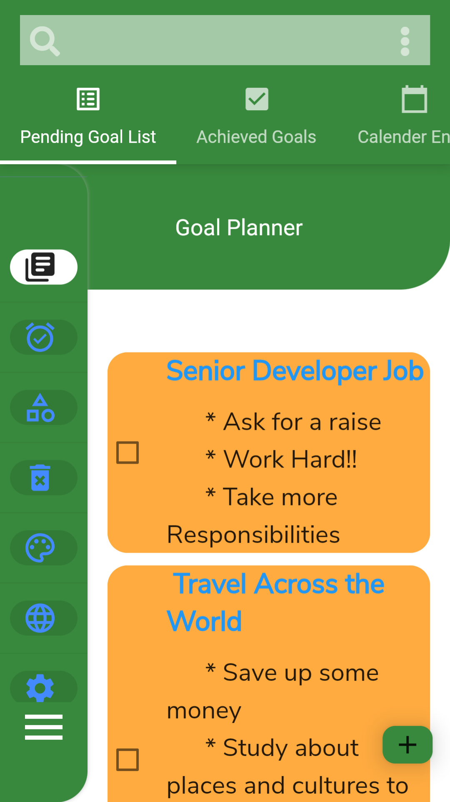

# maya3flutter_app

A Goal setting Flutter APP (UI)
## IMage in read me

## Getting Started 🚀
It's an app that helps you to set goals that you can achieve.

## How to run the app

1 Clone the repo from https://github.com/MaYaEndeshew/maya-flutter-todoApp
2 Install the dependencies using flutter 
3 Start the emulator and Run it

## How to add a goal
1 On the Pending goal list page, click the plus icon on the right side of the screen,
2 When a form pop's up, input the title and description of your goal and then save it.

## User Stories
- A user can set, edit or delete his/her goal list to achieve.
- A user can set a goal reminder date.
- A user can categorize his/her goal list.

## Features
   Edit or Delete a task
    - On the pending goal list page slide the to-do list/set goal to edit or delete that task.
   Change Tabs to go to other pages
    - On the second top nav menu, click on the tabs to change from the default (pending goal list) to achieved goal list and calendar dates for your goal. 
   Side bar
     - Click on the hamburger icon to toggle the side bar menu to open 
     - Click on the times icon to toggle the side bar menu to close.
  
## Dependencies
     -Dart 
     -Flutter
      sdk: flutter
    -cupertino_icons: ^1.0.2
    -google_fonts: ^2.0.0
    -font_awesome_flutter: ^9.0.0
    -provider: ^4.3.2+2
    -flutter_slidable: ^0.5.7
    -table_calendar: ^2.0.1

## For FLutter begginers

This project is a UI design only ,it's a basic starting point for a Flutter application.

A few resources to get you started if this is your first Flutter project:

- [Lab: Write your first Flutter app](https://flutter.dev/docs/get-started/codelab)
- [Cookbook: Useful Flutter samples](https://flutter.dev/docs/cookbook)

For help getting started with Flutter, view our
[online documentation](https://flutter.dev/docs), which offers tutorials,
samples, guidance on mobile development, and a full API reference.
